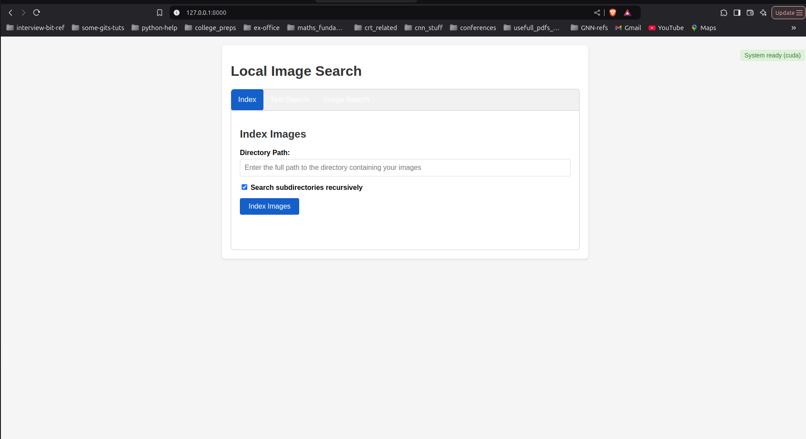
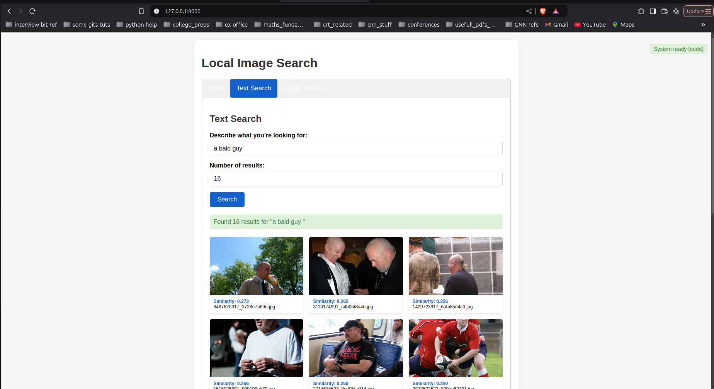
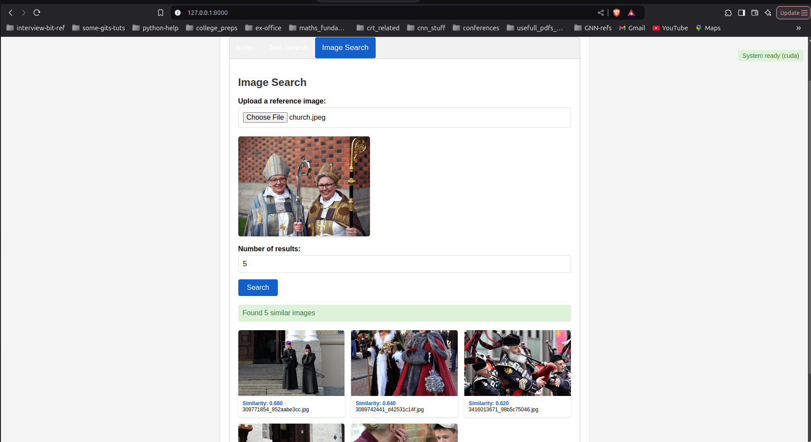

# 🖼️ Local Image Search (Offline CLIP + FAISS)

A **privacy-first, offline image search engine** that runs entirely on your own machine using CLIP and FAISS. Index a folder of images, search them by text or another image, and view results through a lightweight web interface—no cloud, no API calls.

## 🚀 Features

* 🧠 **CLIP Embeddings**: Convert images & text into a shared vector space.
* ⚡ **FAISS Indexing**: Ultra-fast Approximate Nearest Neighbor search.
* 🔍 **Text-to-Image Search**: Describe what you want in natural language.
* 🖼️ **Image-to-Image Search**: Upload an example image to find look-alikes.
* 🖥️ **Flask Web UI**: Simple browser interface at `http://localhost:5000`.
* 🔐 **Fully Offline**: All computation and storage happen locally.

## 📁 Project Structure

```
local_image_search_dev/
├── data/                     # Images you want to index
├── models/                   # FAISS index + index_infos.json
├── results/                  # Fetched search results
├── uploads/                  # Temporary query images
├── src/
│   ├── indexer/              # embedder.py, image_processor.py, index_builder.py
│   ├── searcher/             # query_processor.py, retriever.py
│   └── utils/                # file_utils.py, visualizer.py
├── index.html                # Front-end template
├── search_results.html       # Results template
├── serve.py                  # Flask app entrypoint
├── requirements.txt          # Python dependencies
├── tests/                    # pytest unit tests
└── README.md                 # <- You are here
```

## ⚙️ Installation

1. **Clone the repo**

```bash
git clone https://github.com/your-username/local_image_search.git
cd local_image_search_dev
```

2. **Create a virtual environment & install**

```bash
python -m venv venv
source venv/bin/activate      # Windows: venv\Scripts\activate
pip install -r requirements.txt
```

Dependencies include `torch`, `faiss-cpu`, `flask`, `Pillow`, etc.

## 🧠 First-Time Setup

1. Copy all images you want to index into the `data/` folder. (this can be any folder, pass --recurive to index all sub dirs)
2. Start the server:

```bash
python serve.py
```

3. Open your browser at http://localhost:5000.
4. From the UI, click **Build Index**. CLIP embeddings will be generated and FAISS will build the index—stored under `models/`.

## 🖼️ Usage

1. **Index Your Images**
   * Ensure images are in `data/`. (any folder of choise, the indexes are drop in there, need to be done once)
   * In the web UI, click **Build Index**.
   * Wait for the terminal to report "Index built successfully."




1. **Text-to-Image Search**
   * Enter a textual description, e.g.:
     "Sunset over a calm lake"
   * Hit **Search** and view top matches.



1. **Image-to-Image Search**
   * Upload a query image via the UI.
   * The app returns the most visually similar images.



if you have an image folder that keeps growing, i prefer running a cron, that runs unindex images.


## 📌 Notes

* CLIP model weights are auto-downloaded on first run (no API key required).
* Rebuild the index whenever you add/remove images.
* Index files:
   * `models/image_search.index`
   * `models/index_infos.json`


## 🙌 Contributing

1. Fork the repo
2. Create a feature branch
3. Submit a pull request

## 📝 License

MIT License (to add)

## 🙏 Acknowledgements

* OpenAI CLIP
* Facebook FAISS
* Inspired by various open-source image retrieval pipelines.